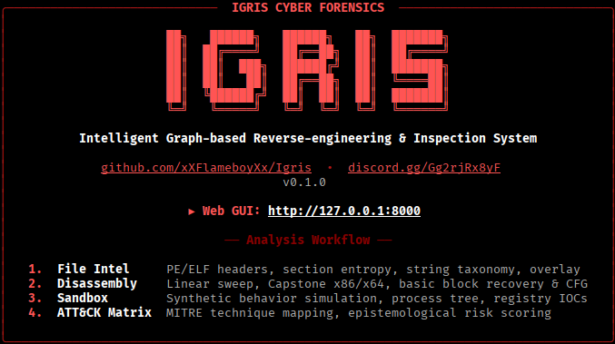

<p align="center">
  <!-- ========================================== -->
  <!--             IGRIS LOGO PLACEHOLDER         -->
  <!-- ========================================== -->
  <a href="https://github.com/xXFlameboyXx/Igris">
    
  </a>
</p>

<h1 align="center">IGRIS</h1>

<p align="center">
  <b>Intelligent Graph-based Reverse-engineering & Inspection System</b><br>
  <i>Explainable malware analysis, disassembly, and threat intelligence — in your browser.</i>
</p>

<p align="center">
  <a href="#-quick-start">Quick Start</a> •
  <a href="#-features">Features</a> •
  <a href="#-supported-file-formats--architectures">Supported Formats</a> •
  <a href="#-installation">Installation</a> •
  <a href="#-cli-commands">Commands</a> •
  <a href="#-analysis-pipeline">Analysis Pipeline</a> •
  <a href="#-responsible-use">Responsible Use</a>
</p>

<p align="center">
  <a href="LICENSE"></a>
  <a href="https://www.python.org/downloads/"></a>
  <a href="https://fastapi.tiangolo.com"></a>
  <a href="https://react.dev"></a>
  <a href="https://www.typescriptlang.org"></a>
  <a href="tests/"></a>
  <a href="SECURITY.md"></a>
</p>

<p align="center">
  <a href="https://discord.gg/Gg2rjRx8yF">
    
  </a>
</p>

<br>

<p align="center">
  
</p>

<br>

---

## ⚡ Quick Start

Install and launch IGRIS with a single command:

```bash
# 1. Clone the repository
git clone https://github.com/xXFlameboyXx/Igris.git
cd Igris

# 2. Run the automated installer
# Windows (PowerShell):
.\install.ps1

# Linux / macOS (Bash):
chmod +x install.sh && ./install.sh

# 3. Launch Igris from ANY directory
igris
```

Your default browser will immediately open `http://127.0.0.1:8000` with the complete cyber-forensics analyst suite.

---

## 🎯 What is IGRIS?

**IGRIS** is an explainable malware-analysis and threat-intelligence platform designed for security engineers, incident responders, and reverse engineers. It bridges the gap between opaque machine learning classifiers and raw manual disassembly by synthesizing multiple independent inspection engines into transparent, evidence-backed verdicts.

### Key Highlights:
- **Zero Host Execution:** Completely safe offline analysis. Untrusted specimens are parsed and simulated mathematically without ever executing on your system.
- **Epistemological Integrity:** Segregates directly observed facts (`OBSERVED`), heuristic findings (`POSSIBLE`), and statistical models (`INFERRED`) to avoid false confidence.
- **Interactive Visual Lab:** Dark crimson cyber-forensics UI featuring interactive Control Flow Graphs (CFG), categorized string taxonomy, timeline filtering, and live search.
- **Standalone PDF Dossiers:** Generate publication-quality intelligence dossiers and evidence reports with a single click.

---

## 🔍 Features

| Analysis Engine | Capabilities |
| :--- | :--- |
| **📁 File Intelligence** | Content-addressed SHA-256 inert storage, Shannon entropy mapping, and bounds-checked PE & ELF header parsing. |
| **🔬 Static Analysis** | Categorized string extraction, import capability taxonomy (Process Injection, Persistence, Evasion), section entropy, and overlay detection. |
| **⚡ Safe Disassembly & CFG** | Linear sweep disassembly powered by [Capstone](http://www.capstone-engine.org/), basic block recovery, and interactive Control Flow Graph (CFG) visualizer. |
| **🎯 Heuristic Rules Engine** | Declarative YAML detection rules, weighted severity assessment, and granular rule-hit explanations. |
| **🤖 Explainable ML & SHAP** | Random Forest & Gradient Boosting classifiers with tree-based SHAP explainability showing exact feature contributions per verdict. |
| **🧪 Behavioral Simulation** | Deterministic synthetic telemetry engine simulating process trees, registry mutations, and network sockets safely offline. |
| **🧬 Similarity Clustering** | SSDEEP & TLSH fuzzy hashing with locality-sensitive distance clustering against known malware families. |
| **🗺️ MITRE ATT&CK Mapping** | Automated mapping of extracted binary capabilities to MITRE ATT&CK enterprise tactics and techniques. |
| **📝 Investigation Workspace** | Evidence bookmarking, analyst notes, timeline filtering, and in-memory pure PDF dossier report generation. |
| **🚀 Global CLI Launcher** | Single-command startup (`igris`) from any directory with port conflict detection and browser management. |

---

## 📦 Supported File Formats & Architectures

IGRIS safely ingests, unpacks, disassembles, and evaluates a wide variety of binary formats:

| Category | File Types & Extensions | Target Architectures | Capabilities & Inspections |
| :--- | :--- | :--- | :--- |
| **Windows Binaries** | `.exe`, `.dll`, `.sys`, `.scr`, `.ocx`, `.cpl` | `x86` (32-bit PE32)<br>`x86-64` (64-bit PE32+) | DOS/PE headers, section entropy, Import Address Table (IAT) capability taxonomy, Export table, overlays, digital certificate parsing. |
| **Linux Binaries** | Executables, `.so` shared objects, `.o` object files | `ELF32`, `ELF64`<br>(`x86`, `x86_64`, `ARM`, `MIPS`) | ELF header validation, segment/program headers, section mappings, symbol tables, dynamic shared library links. |
| **Raw Shellcode & Payloads** | `.bin`, `.raw`, `.dat`, `.dmp`, memory blobs | `x86`, `x86-64` | Linear sweep disassembly via Capstone, basic block recovery, interactive Control Flow Graphs (CFG), opcode entropy. |
| **Scripts & Source Code** | `.py`, `.ps1`, `.sh`, `.bat`, `.js`, `.vbs`, `.c`, `.c#`, `.java`, `.cpp`, `.php` | Interpreted / Source Code | Static IOC extraction, hardcoded C2 URLs/IPs, Base64/obfuscated block entropy detection, SSDEEP & TLSH similarity clustering, dossier export. |
| **Generic & Unknown Specimens** | Any binary blob or suspicious file | Architecture-Agnostic | SHA-256 / MD5 / SHA-1 hashes, Shannon entropy visualization, categorized ASCII & UTF-16 string extraction (URLs, IPs, Onion links, Registry paths), SSDEEP & TLSH fuzzy clustering. |

---

More formats like androids apps(.apk , .aab , .dex) , apple/MacOS Binaries(.dylib , macOS apps) , iOS Packages(.ipa) , Documents(.docm , .xlsm , .pdf) and archives (.zip, .rar, .7z, .iso, .vhd) COMING SOON !! 
 

## 🛠️ Installation

### Prerequisites
- **Python:** 3.11 or newer ([python.org](https://python.org))
- **Node.js:** 18+ *(optional to pre-install; installer automatically installs Node.js & npm if not detected)*
- **Git:** ([git-scm.com](https://git-scm.com))

### 1. Clone the Repository
```bash
git clone https://github.com/xXFlameboyXx/Igris.git
cd Igris
```

### 2. Run the Automated Installer

**Windows (PowerShell):**
```powershell
.\install.ps1
```

**Linux / macOS (Bash):**
```bash
chmod +x install.sh && ./install.sh
```

*The installer automatically configures the Python virtual environment, installs Node.js/npm if missing, compiles the frontend bundle, and registers the global `igris` command on your system PATH.*

---

## 💻 CLI Commands

| Command | Description |
| :--- | :--- |
| `igris` | Launch the Igris server and open the Web GUI in your browser. |
| `igris --update` | Pull latest updates from GitHub, update dependencies, and rebuild frontend. |
| `igris --status` | Check if an Igris server instance is currently running. |
| `igris --stop` | Stop any active Igris background server. |
| `igris --repair` | Rebuild frontend assets and verify system dependencies. |
| `igris --port <PORT>` | Run Igris on a custom port (default: `8000`). |
| `igris --no-browser` | Start the server without opening the web browser automatically. |
| `igris --version` | Display installed version (`Igris v0.1.0`). |
| `igris --help` | Show all available command-line flags. |

---

## 🔬 Analysis Pipeline

```text
  [ Binary Upload ]  (PE / ELF Executable)
          │
          ├──► File Intelligence  (SHA-256, Entropy, Headers, Overlay)
          ├──► Static Analysis    (String Taxonomy, Imports, Capabilities)
          ├──► Disassembly & CFG  (Linear Sweep, Basic Blocks, Control Flow)
          ├──► Heuristics Engine  (YAML Rules, Severity Weights)
          ├──► ML Classifier      (Tree Models, SHAP Feature Importance)
          ├──► Sandbox Simulation (Process Trees, Registry IOCs, Network)
          ├──► Similarity Hash    (SSDEEP, TLSH Clustering)
          └──► MITRE ATT&CK       (Tactics, Techniques, Sub-techniques)
                      │
                      ▼
        [ Epistemological Assessment ]
         (Observed vs. Inferred vs. Possible)
                      │
                      ▼
     [ Interactive Workspace & PDF Dossier ]
```

---

## 🛡️ Responsible Use & Safety

- **Laboratory & Research Purpose:** IGRIS is built exclusively for defensive cybersecurity research, reverse engineering education, and authorized forensic inspection.
- **Zero Host Risk:** Untrusted binaries are parsed as inert byte buffers and evaluated in a simulated offline environment. They are never executed directly on the host operating system.
- **Local Isolation:** By default, IGRIS binds strictly to `127.0.0.1`. Never expose an unauthenticated instance to the public internet.

For full guidelines, see [`docs/responsible-use.md`](docs/responsible-use.md).

---

## 🤝 Community & Contributing

Contributions, issues, and feature requests are welcome!
- **Discord:** [Join the IGRIS Community](https://discord.gg/Gg2rjRx8yF)
- **GitHub Issues:** [Report a Bug / Request a Feature](https://github.com/xXFlameboyXx/Igris/issues)
- **Contribution Guidelines:** See [`CONTRIBUTING.md`](CONTRIBUTING.md)

---

## 📜 License & Copyright

Copyright © 2026 **xXFlameboyXx**. All rights reserved.

IGRIS is a proprietary, source-available project. It is provided strictly for personal evaluation, educational inspection, and authorized security research. Unauthorized copying, distribution, modification, rebranding, commercialization, or hosting as a public service is strictly prohibited without prior written consent.

See the full terms in [`LICENSE`](LICENSE).

---

<p align="center">
  <sub>IGRIS™ and the IGRIS logo are trademarks of xXFlameboyXx.</sub>
</p>
