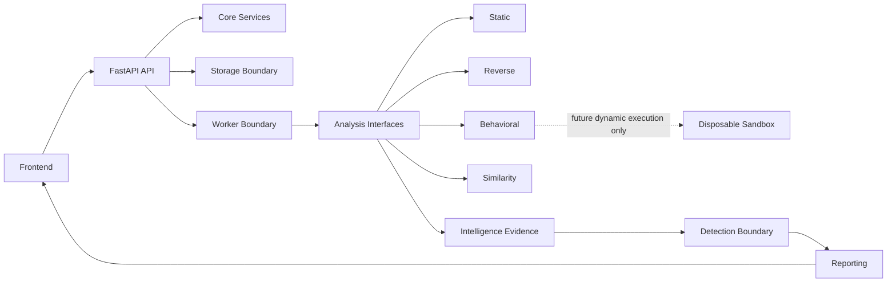

# Architecture

Igris is organized as a set of explicit boundaries rather than a monolith. Phase 0
provides application structure and interfaces only.

## System Boundaries

- Frontend: Browser-based analyst interface built with React and Vite.
- API: FastAPI application exposing versioned HTTP endpoints and request conventions.
- Core: Shared configuration, logging, error handling, and request context.
- Analysis: Future static, reverse, behavioral, and similarity interfaces.
- Detection: Future rules, heuristics, and ML interfaces.
- Intelligence: Future evidence correlation, ATT&CK mapping, and attribution boundaries.
- Reporting: Future explainable report generation.
- Storage: Future sample metadata, evidence, and artifact storage.
- Workers: Future asynchronous orchestration outside the API request path.
- Sandbox: Future disposable environment for dynamic execution only.

## Component Diagram

## Future Analysis Pipeline

1. API receives metadata and a hostile sample as data.
2. Storage assigns a server-side sample ID and writes the file to controlled storage.
3. Workers enqueue analysis jobs without executing analysis inside API handlers.
4. Static and reverse workflows inspect samples as data in constrained environments.
5. Behavioral workflows run only in disposable sandbox environments.
6. Intelligence correlates normalized evidence.
7. Detection evaluates evidence with explainable findings.
8. Reporting renders analyst-facing summaries with traceable evidence.

The current repository stops at steps 1 through 3 as interfaces and conventions.

## Storage Model

Phase 0 defines `SampleRepository` and `StoredSample` interfaces only. Future storage
must separate raw hostile samples, derived artifacts, normalized evidence, report
material, and audit records. User-controlled filenames must never become trusted
filesystem paths.

## API Layer

The API is versioned under `/api/v1`. A root `/health` alias exists for simple
operational checks. Responses follow these conventions:

- Successful resources are strongly typed with Pydantic schemas.
- Errors use `{ "success": false, "error": { "code": "...", "message": "..." }, "request_id": "..." }`.
- Every response includes an `X-Request-ID` header.
- Validation errors avoid echoing raw request bodies.

## Worker Model

Future long-running analysis should run through workers. API handlers should accept,
validate, authorize, and enqueue work; they should not parse or execute hostile files.

## Security Boundary

The sandbox is not a library call. It is a separate disposable environment with no
application secrets, constrained networking, strict resource limits, and cleanup
between analyses.

## Data Flow

Hostile input flows from API intake into controlled storage, then through isolated
analysis workers into normalized evidence and reports. Raw hostile content should not
flow into logs, exception payloads, frontend text, or developer tooling.

